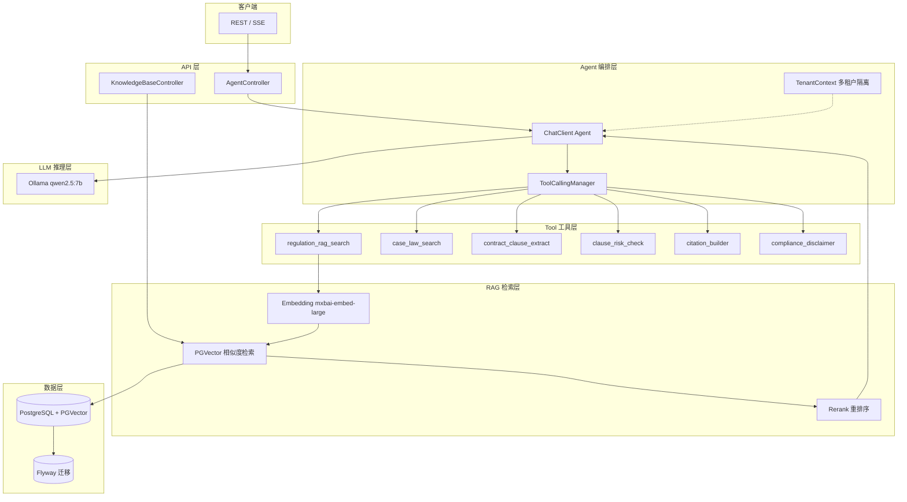

# LawGuard AI

> **一句话**：律所和企业法务的 AI Agent + RAG 助手。合同 AI 审查、法规智能检索、类案推送、合规风险评估。

**LawGuard AI** 是一套法律合规 AI Agent + RAG 系统，基于 **Spring AI 2.0 + Agent Tool Calling + PGVector RAG + Ollama** 构建，面向律所、企业法务和合规团队，解决法律场景中的 AI 幻觉问题——所有结论均附带可追溯的法条引用。

🛡️ **核心能力**：合同审查 · 法规检索 · 类案推送 · 合规评估

> 💼 企业版见 [LawGuard Enterprise](https://github.com/HH-SpringAI-Agent-Starter/lawguard-enterprise)，支持多租户/私有化部署。
>
> ⚖️ 本项目仅用于技术研究，不构成专业法律建议。

---

## 📑 目录

1. [为什么选择 LawGuard](#1-为什么选择-lawguard)
2. [功能矩阵](#2-功能矩阵)
3. [快速开始](#3-快速开始)
4. [API 一览](#4-api-一览)
5. [系统架构](#5-系统架构)
6. [常见问题（FAQ）](#6-常见问题faq)
7. [贡献与许可](#7-贡献与许可)

---

## 1. 为什么选择 LawGuard

> **Answer First**：律所和企业法务的 AI Agent + RAG 助手。合同 AI 审查、法规智能检索、类案推送、合规风险评估，全部结论附法条引用。

| 维度 | 本方案 | 通用方案 |
|------|--------|---------|
| 专业性 | 法律合规领域深度优化 | 通用知识，无行业数据 |
| 部署方式 | 本地部署（Ollama） | SaaS only |
| 可审计性 | 开源可审查 | 黑盒 |

**核心价值主张：**

- **可追溯**：RAG 检索的所有法律结论均附原法条引用，杜绝编造
- **本地优先**：默认 Ollama 本地部署，数据不出企业内网
- **开源可审计**：Apache-2.0 许可，代码公开、部署透明

---

## 2. 功能矩阵

| 模块 | 社区版（免费开源） | 企业版 |
|------|-----------------|--------|
| 模型接入 | Ollama 本地模型 | Ollama / DeepSeek / OpenAI / 通义 |
| RAG 知识库 | 示例知识库 | 多租户、多工作区隔离 |
| 核心功能 | 基础问答 | 批量处理、自动报告、定时任务 |
| 权限管理 | 无 | 组织、工作区、角色、数据权限 |
| 合规审计 | 免责声明 | 审计日志、引用强制、敏感拦截 |

---

## 3. 快速开始

```bash
cp .env.example .env
docker compose up -d postgres redis minio
ollama pull qwen2.5:7b
mvn spring-boot:run
```

**环境要求**：JDK 21+ · Maven 3.9+ · Docker · Ollama

**示例调用：**

```bash
curl -s -X POST http://localhost:8080/api/agent/ask \
  -H 'Content-Type: application/json' \
  -H 'X-Tenant-Id: demo' \
  -d '{
    "question": "请审查这段竞业限制条款，指出对公司和员工分别有哪些风险。",
    "userId": "u_1001",
    "sessionId": "s_demo"
  }' | jq
```

---

## 4. API 一览

| Method | Path | Description |
|--------|------|-------------|
| POST | `/api/agent/ask` | 法律/合规研究问答 |
| POST | `/api/contracts/review` | 合同风险审查 |
| POST | `/api/compliance/check` | 合规话术与规则检查 |
| POST | `/api/kb/sync` | 同步知识库 |
| GET | `/api/kb/search?q=` | 检索知识库 |

---

## 5. 系统架构



**数据流：**

```text
用户输入 (自然语言问题/合同文本)
    ↓
TenantContext 提取 (X-Tenant-Id Header)
    ↓
ChatClient → 意图识别 → 选择工具调用链
    ├── 合同审查流: contract_clause_extract → clause_risk_check → citation_builder
    ├── 法规检索流: regulation_rag_search → citation_builder
    ├── 类案检索流: case_law_search → citation_builder
    └── 合规检查流: compliance_disclaimer / regulation_rag_search → clause_risk_check
    ↓
RAG 检索 (Embedding → PGVector Top-K → Rerank)
    ↓
LLM 推理 (Prompt模板 + 检索结果 + 用户输入)
    ↓
compliance_disclaimer (法律免责声明附加)
    ↓
响应 JSON (结论 + 引用来源 + 置信度 + 免责声明)
```

---

## 6. 常见问题（FAQ）

<details>
<summary><b>Q1: 是什么？</b></summary>

**A:** 律所和企业法务的 AI Agent + RAG。合同 AI 审查、法规智能检索、类案推送、合规风险评估，所有结论附带可追溯的法条引用。

</details>

<details>
<summary><b>Q2: 和通用 AI 有什么区别？</b></summary>

**A:** 通用 AI 可能编造法条。LawGuard 基于法规库 RAG，引用可追源到原法条；且默认本地部署，数据不出内网。

</details>

---

## 7. 贡献与许可

- **许可证**：社区版 [Apache-2.0](LICENSE)
- **作者**：[HH-SpringAI-Agent-Starter](https://github.com/HH-SpringAI-Agent-Starter)
- **贡献指南**：[CONTRIBUTING.md](CONTRIBUTING.md)

---

> 🚀 **关联项目**：[LawGuard Enterprise（企业版）](https://github.com/HH-SpringAI-Agent-Starter/lawguard-enterprise) | [更多项目](https://github.com/HH-SpringAI-Agent-Starter)
