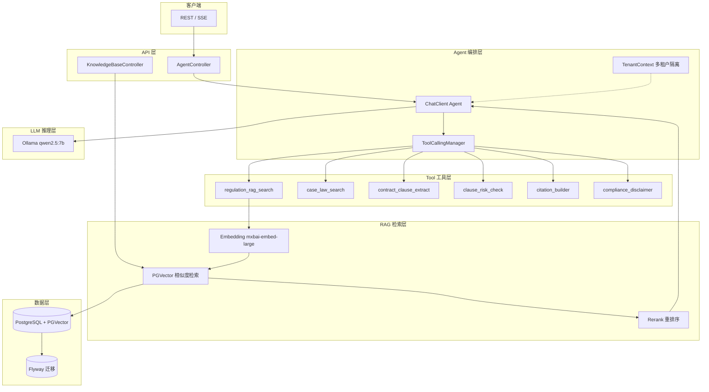

# LawGuard AI — 完整功能需求文档

## 1. 项目概述

**LawGuard AI** 是面向律所和企业法务的开源 AI Agent + RAG 系统，基于 Spring AI 2.0 构建。核心目标是用 RAG 检索增强生成技术，解决合同审查、法规检索、类案推送、合规风险评估四大法律场景中的 AI 幻觉问题。

### 1.1 核心价值主张
- **可追溯**：RAG 检索的所有法律结论均附原法条引用，杜绝编造
- **本地优先**：默认 Ollama 本地部署，数据不出企业内网
- **开源可审计**：Apache-2.0 许可，代码公开、部署透明

### 1.2 技术栈
| 层级 | 技术选型 |
|------|----------|
| 框架 | Spring Boot 4.0 + Spring AI 2.0 |
| AI 编排 | ChatClient Agent + @Tool Function Calling |
| 向量数据库 | PGVector (PostgreSQL 扩展) |
| 默认模型 | Ollama: qwen2.5:7b (对话) + mxbai-embed-large (嵌入) |
| 数据库迁移 | Flyway |
| 可观测性 | Micrometer + Prometheus + Actuator |
| 容器化 | Docker Compose |
| 构建工具 | Maven 3.9+ |
| JDK | 21+ |

---

## 2. 功能模块

### 2.1 合同审查模块 (Contract Review)

**优先级：P0 (核心)**

| 功能 | 描述 | 输入 | 输出 |
|------|------|------|------|
| 条款提取 | 从合同文本中自动识别并提取关键条款（竞业限制、保密、违约金、知识产权等） | 合同文本/PDF | 结构化条款列表 |
| 风险识别 | 对每条条款进行风险评级（高/中/低），指出对各方的不利点 | 已提取条款 | 风险标注 + 风险说明 |
| 修改建议 | 针对高风险条款生成替代表述建议 | 风险条款 | 建议修改文本 + 法律依据 |
| 完整性检查 | 检查合同是否缺少行业标准必要条款 | 合同全文 | 缺失条款清单 |

**工具定义：**
- `contract_clause_extract` — 从合同文本提取结构化条款
- `clause_risk_check` — 对单条/批量条款进行风险评级

### 2.2 法规检索模块 (Regulation Search)

**优先级：P0 (核心)**

| 功能 | 描述 | 输入 | 输出 |
|------|------|------|------|
| 语义检索 | 用自然语言问题检索相关法规条文 | 自然语言问题 | Top-K 相关法规片段 + 来源 |
| 法规对比 | 对比不同版本/不同地区法规的差异 | 两条法规引用 | 差异对比表 |
| 时效性检查 | 检查引用的法规是否现行有效 | 法规名称/文号 | 有效性状态 + 替代法规 |
| 层级导航 | 按法律→行政法规→部门规章→地方法规层级过滤 | 关键词 + 层级 | 分层级法规列表 |

**工具定义：**
- `regulation_rag_search` — 法规语义检索，返回 Top-K 条 + 条文原文

### 2.3 类案推送模块 (Case Law)

**优先级：P1**

| 功能 | 描述 | 输入 | 输出 |
|------|------|------|------|
| 相似案例检索 | 根据案情描述检索相似判例 | 案情描述文本 | Top-K 相似案例摘要 |
| 裁判观点提取 | 从案例中提取法院核心裁判观点 | 案例ID/文号 | 裁判观点列表 |
| 胜诉率预估 | 基于相似案例统计预估胜诉概率 | 案情要素 | 胜诉率 + 关键影响因素 |
| 引用链分析 | 追源案例引用的法条和其他案例 | 案例ID | 引用关系图 |

**工具定义：**
- `case_law_search` — 类案语义检索

### 2.4 合规风险评估模块 (Compliance Check)

**优先级：P1**

| 功能 | 描述 | 输入 | 输出 |
|------|------|------|------|
| 合规话术生成 | 根据业务场景生成合规声明/免责话术 | 业务场景描述 | 合规声明文本 |
| 规则匹配 | 将企业制度与外部法规进行匹配检查 | 企业制度 + 法规范围 | 匹配/冲突报告 |
| 处罚检索 | 检索特定违规行为的历史处罚案例 | 违规行为描述 | 处罚案例 + 罚款金额范围 |
| 合规评分 | 对企业/合同的合规程度进行量化评分 | 检查项清单 | 百分制得分 + 风险项 |

**工具定义：**
- `compliance_disclaimer` — 合规声明生成
- `citation_builder` — 法规引用格式化

---

## 3. 架构设计

### 3.1 系统架构图



### 3.2 数据流

```text
用户输入 (自然语言问题/合同文本)
    ↓
TenantContext 提取 (X-Tenant-Id Header)
    ↓
ChatClient → 意图识别 → 选择工具调用链
    ├── 合同审查流: contract_clause_extract → clause_risk_check → citation_builder
    ├── 法规检索流: regulation_rag_search → citation_builder
    ├── 类案检索流: case_law_search → citation_builder
    └── 合规检查流: compliance_disclaimer / regulation_rag_search → clause_risk_check
    ↓
RAG 检索 (Embedding → PGVector Top-K → Rerank)
    ↓
LLM 推理 (Prompt模板 + 检索结果 + 用户输入)
    ↓
compliance_disclaimer (法律免责声明附加)
    ↓
响应 JSON (结论 + 引用来源 + 置信度 + 免责声明)
```

### 3.3 目录结构

```text
lawguard-ai/
├── src/main/java/com/agentstack/lawguard/
│   ├── agent/          # Agent 编排 & ChatClient 配置
│   ├── config/         # ChatClient 等配置类
│   ├── controller/     # REST 控制器 (Agent/KnowledgeBase)
│   ├── dto/            # 请求/响应 DTO
│   ├── rag/            # RAG 服务 (PGVector)
│   ├── tenant/         # 多租户上下文与过滤器
│   └── tools/          # @Tool 注解工具实现
├── src/main/resources/
│   ├── db/migration/   # Flyway 初始化 SQL
│   └── kb/             # 示例知识库 (法规/合同/案例/合规)
├── docs/               # 架构、API、部署、定价、安全文档
├── docker-compose.yml  # 一键基础设施
└── pom.xml
```

---

## 4. API 清单

| Method | Path | Description |
|--------|------|-------------|
| POST | `/api/agent/ask` | 法律/合规研究问答 |
| POST | `/api/contracts/review` | 合同风险审查 |
| POST | `/api/compliance/check` | 合规话术与规则检查 |
| POST | `/api/kb/sync` | 同步知识库 |
| GET | `/api/kb/search?q=` | 检索知识库 |

---

## 5. 非功能需求

| 编号 | 需求 | 说明 |
|------|------|------|
| NFR-1 | 可追溯性 | 所有 AI 结论必须附法条/案例来源引用 |
| NFR-2 | 本地化 | 默认本地 Ollama 部署，数据不出内网 |
| NFR-3 | 多租户 | X-Tenant-Id Header 租户隔离 |
| NFR-4 | 可观测性 | Prometheus / Actuator 指标暴露 |
| NFR-5 | 免责声明 | 所有输出附加法律免责声明 |
| NFR-6 | 可迁移 | Flyway 管理数据库版本 |

---

## 6. 路线图

| 版本 | 内容 |
|------|------|
| v0.1.0 (2026-06) | 社区版初始发布：6 工具 + RAG + REST API + Docker Compose |
| v0.2.0 (2026-07) | 根级文档补齐：requirements/CONTRIBUTING/CHANGELOG/架构图 |
| v0.2.1 (2026-08) | 文档 UTF-8 乱码修复 + 根 LICENSE + 架构图重绘（Mermaid） |
| v1.0.0 (规划) | 电子合同解析（PDF/Word）、批量审查、审计日志、企业版 API |
